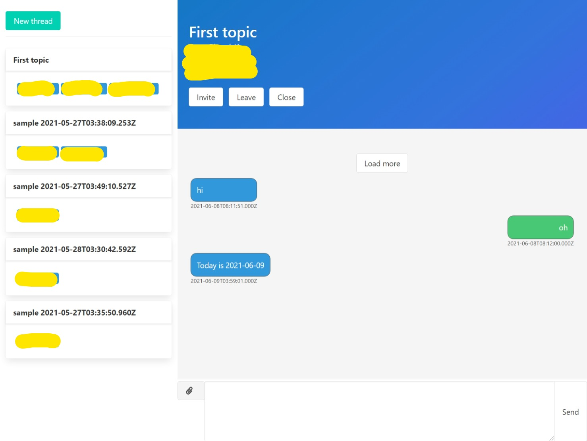

# Azure Communication Services Chat

## References

* [Chat SDK overview](https://docs.microsoft.com/ko-kr/azure/communication-services/concepts/chat/sdk-features)
* [Azure-Sample/communication-services-web-chat-hero](https://github.com/Azure-Samples/communication-services-web-chat-hero)

## Run

```bash
$ cd src/Sample.Chat
$ dotnet run
```



## Docker

### build

```bash
$ docker build . -t your-name/app-name:tag
```

### Run

```bash
# create files directory
$ mkdir files
# run docker container
$ docker run -d \
  --name sample-chat
  -e TZ=Asia/Seoul
  -e ASPNETCORE_ENVIRONMENT=Production
  -e ASPNETCORE_URLS=http://+:5000
  -e ConnectionStrings__Default=<database connection string>
  -e ConnectionStrings__AzureCommunicationServices=<Azure Communication Service connection string>
  -e App__Title=Chat App
  -e App__Description=Sample for Azure Communication Services Chat
  -v ./files:/files
  your-name/app-name:tag
```